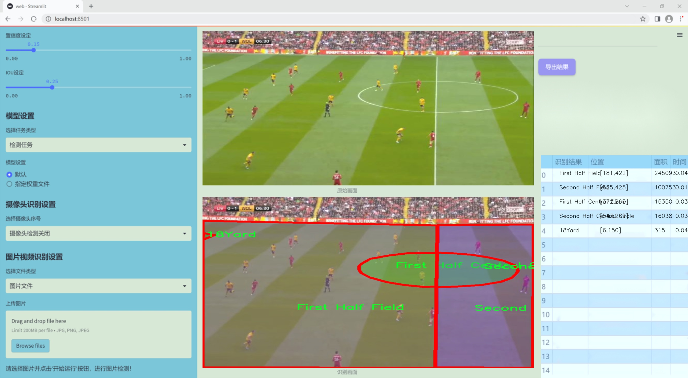

# 改进yolo11-ContextGuidedDown等200+全套创新点大全：足球场地区域图像分割系统源码＆数据集全套

### 1.图片效果展示




##### 项目来源 **[人工智能促进会 2024.10.28](https://kdocs.cn/l/cszuIiCKVNis)**

注意：由于项目一直在更新迭代，上面“1.图片效果展示”和“2.视频效果展示”展示的系统图片或者视频可能为老版本，新版本在老版本的基础上升级如下：（实际效果以升级的新版本为准）

  （1）适配了YOLOV11的“目标检测”模型和“实例分割”模型，通过加载相应的权重（.pt）文件即可自适应加载模型。

  （2）支持“图片识别”、“视频识别”、“摄像头实时识别”三种识别模式。

  （3）支持“图片识别”、“视频识别”、“摄像头实时识别”三种识别结果保存导出，解决手动导出（容易卡顿出现爆内存）存在的问题，识别完自动保存结果并导出到tempDir中。

  （4）支持Web前端系统中的标题、背景图等自定义修改。

  另外本项目提供训练的数据集和训练教程,暂不提供权重文件（best.pt）,需要您按照教程进行训练后实现图片演示和Web前端界面演示的效果。

### 2.视频效果展示

[2.1 视频效果展示](https://www.bilibili.com/video/BV18bSxYXEuT/)

### 3.背景

研究背景与意义

随着计算机视觉技术的迅猛发展，图像分割在体育分析、场景理解等领域的应用愈发广泛。足球作为全球最受欢迎的运动之一，其比赛分析、战术研究和运动员表现评估都离不开对比赛场地及球员动态的精准捕捉与分析。因此，基于深度学习的图像分割技术在足球场景中的应用具有重要的研究价值和实际意义。尤其是YOLO（You Only Look Once）系列模型，以其高效的实时检测能力和较强的准确性，成为了目标检测和分割领域的热门选择。

本研究旨在基于改进的YOLOv11模型，构建一个针对足球场地区域的图像分割系统。我们将利用包含661幅图像的“football boxes”数据集，该数据集涵盖了足球场上多个关键区域的标注，包括18码区、5码区、上下半场中央圈等。通过对这些区域的精确分割，能够为教练和分析师提供更加细致的战术分析工具，帮助他们更好地理解比赛动态，优化战术安排。

在现有的图像分割技术中，尽管已有多种模型在不同场景下取得了良好的效果，但针对足球场景的特定需求，仍存在许多挑战。例如，复杂的场地背景、不同光照条件下的图像质量以及球员与场地之间的动态交互等，都对模型的分割精度提出了更高的要求。因此，改进YOLOv11模型以适应这些特定场景，将有助于提升分割效果，进而推动足球比赛分析的智能化进程。

综上所述，本研究不仅具有重要的理论意义，还将为实际应用提供强有力的技术支持，推动体育数据分析的智能化和自动化发展，为足球运动的科学训练和战术研究提供新的视角和工具。

### 4.数据集信息展示

##### 4.1 本项目数据集详细数据（类别数＆类别名）

nc: 7
names: ['18Yard Circle', '18Yard', '5Yard', 'First Half Central Circle', 'First Half Field', 'Second Half Central Circle', 'Second Half Field']


该项目为【图像分割】数据集，请在【训练教程和Web端加载模型教程（第三步）】这一步的时候按照【图像分割】部分的教程来训练

##### 4.2 本项目数据集信息介绍

本项目数据集信息介绍

本项目所使用的数据集名为“football boxes”，旨在为改进YOLOv11的足球场地区域图像分割系统提供支持。该数据集包含七个类别，分别为“18Yard Circle”、“18Yard”、“5Yard”、“First Half Central Circle”、“First Half Field”、“Second Half Central Circle”和“Second Half Field”。这些类别涵盖了足球场上不同的关键区域，为模型的训练提供了丰富的样本和多样化的场景。

“football boxes”数据集的设计充分考虑了足球比赛的特点，确保能够有效捕捉到场地的各个重要部分。每个类别都代表了足球场上特定的区域，这些区域在比赛中具有重要的战术意义。例如，“18Yard Circle”和“18Yard”分别对应于禁区和其周边区域，这些区域在进攻和防守中都至关重要；而“5Yard”则标识了球场上的短距离区域，通常涉及快速传球和战术配合。

此外，数据集中还包括了“First Half Central Circle”和“Second Half Central Circle”，这两个类别标识了比赛上下半场的中心圈，能够帮助模型理解比赛的节奏和场上动态变化。而“First Half Field”和“Second Half Field”则提供了整个场地的分割信息，使得模型能够在不同的比赛阶段中进行准确的区域识别。

通过对“football boxes”数据集的训练，改进后的YOLOv11将能够更好地识别和分割足球场上的各个关键区域，从而提升其在实际应用中的表现。该数据集不仅为模型提供了必要的训练数据，还为后续的模型评估和优化奠定了基础，确保能够在复杂的足球场景中实现高效的图像分割。


### 5.全套项目环境部署视频教程（零基础手把手教学）

[5.1 所需软件PyCharm和Anaconda安装教程（第一步）](https://www.bilibili.com/video/BV1BoC1YCEKi/?spm_id_from=333.999.0.0&vd_source=bc9aec86d164b67a7004b996143742dc)


[5.2 安装Python虚拟环境创建和依赖库安装视频教程（第二步）](https://www.bilibili.com/video/BV1ZoC1YCEBw?spm_id_from=333.788.videopod.sections&vd_source=bc9aec86d164b67a7004b996143742dc)

### 6.改进YOLOv11训练教程和Web_UI前端加载模型教程（零基础手把手教学）

[6.1 改进YOLOv11训练教程和Web_UI前端加载模型教程（第三步）](https://www.bilibili.com/video/BV1BoC1YCEhR?spm_id_from=333.788.videopod.sections&vd_source=bc9aec86d164b67a7004b996143742dc)


按照上面的训练视频教程链接加载项目提供的数据集，运行train.py即可开始训练



     Epoch   gpu_mem       box       obj       cls    labels  img_size
     1/200     20.8G   0.01576   0.01955  0.007536        22      1280: 100%|██████████| 849/849 [14:42<00:00,  1.04s/it]
               Class     Images     Labels          P          R     mAP@.5 mAP@.5:.95: 100%|██████████| 213/213 [01:14<00:00,  2.87it/s]
                 all       3395      17314      0.994      0.957      0.0957      0.0843

     Epoch   gpu_mem       box       obj       cls    labels  img_size
     2/200     20.8G   0.01578   0.01923  0.007006        22      1280: 100%|██████████| 849/849 [14:44<00:00,  1.04s/it]
               Class     Images     Labels          P          R     mAP@.5 mAP@.5:.95: 100%|██████████| 213/213 [01:12<00:00,  2.95it/s]
                 all       3395      17314      0.996      0.956      0.0957      0.0845

     Epoch   gpu_mem       box       obj       cls    labels  img_size
     3/200     20.8G   0.01561    0.0191  0.006895        27      1280: 100%|██████████| 849/849 [10:56<00:00,  1.29it/s]
               Class     Images     Labels          P          R     mAP@.5 mAP@.5:.95: 100%|███████   | 187/213 [00:52<00:00,  4.04it/s]
                 all       3395      17314      0.996      0.957      0.0957      0.0845


###### [项目数据集下载链接](https://kdocs.cn/l/cszuIiCKVNis)

### 7.原始YOLOv11算法讲解


###### YOLOv11改进方向

与YOLOv 10相比，YOLOv 11有了巨大的改进，包括但不限于：

  * 增强的模型结构：模型具有改进的模型结构，以获取图像处理并形成预测
  * GPU优化：这是现代ML模型的反映，GPU训练ML模型在速度和准确性上都更好。
  * 速度：YOLOv 11模型现在经过增强和GPU优化以用于训练。通过优化，这些模型比它们的前版本快得多。在速度上达到了25%的延迟减少！
  * 更少的参数：更少的参数允许更快的模型，但v11的准确性不受影响
  * 更具适应性：更多支持的任务YOLOv 11支持多种类型的任务、多种类型的对象和多种类型的图像。

###### YOLOv11功能介绍

Glenn Jocher和他的团队制作了一个令人敬畏的YOLOv 11迭代，并且在图像人工智能的各个方面都提供了YOLO。YOLOv 11有多种型号，包括：

  * 对象检测-在训练时检测图像中的对象
  * 图像分割-超越对象检测，分割出图像中的对象
  * 姿态检测-当用点和线训练时绘制一个人的姿势
  * 定向检测（OBB）：类似于对象检测，但包围盒可以旋转
  * 图像分类-在训练时对图像进行分类

使用Ultralytics Library，这些模型还可以进行优化，以：

  * 跟踪-可以跟踪对象的路径
  * 易于导出-库可以以不同的格式和目的导出
  * 多场景-您可以针对不同的对象和图像训练模型

此外，Ultralytics还推出了YOLOv 11的企业模型，该模型将于10月31日发布。这将与开源的YOLOv
11模型并行，但将拥有更大的专有Ultralytics数据集。YOLOv 11是“建立在过去的成功”的其他版本的之上。

###### YOLOv11模型介绍

YOLOv 11附带了边界框模型（无后缀），实例分割（-seg），姿态估计（-pose），定向边界框（-obb）和分类（-cls）。

这些也有不同的尺寸：纳米（n），小（s），中（m），大（l），超大（x）。


YOLOv11模型

###### YOLOv11与前版本对比

与YOLOv10和YOLOv8相比，YOLOv11在Ultralytics的任何帖子中都没有直接提到。所以我会收集所有的数据来比较它们。感谢Ultralytics：

**检测：**


YOLOv11检测统计


YOLOv10检测统计

其中，Nano的mAPval在v11上为39.5，v10上为38.5；Small为47.0 vs 46.3，Medium为51.5 vs
51.1，Large为53.4 vs 53.2，Extra Large为54.7vs
54.4。现在，这可能看起来像是一种增量增加，但小小数的增加可能会对ML模型产生很大影响。总体而言，YOLOv11以0.3
mAPval的优势追平或击败YOLOv10。

现在，我们必须看看速度。在延迟方面，Nano在v11上为1.55 , v10上为1.84，Small为2.46 v2.49，Medium为4.70
v4.74，Large为6.16 v7.28，Extra Large为11.31
v10.70。延迟越低越好。YOLOv11提供了一个非常低的延迟相比，除了特大做得相当差的前身。

总的来说，Nano模型是令人振奋的，速度更快，性能相当。Extra Large在性能上有很好的提升，但它的延迟非常糟糕。

**分割：**


YOLOV11 分割统计


YOLOV9 分割统计


YOLOV8 分割数据

总体而言，YOLOv 11上的分割模型在大型和超大型模型方面比上一代YOLOv 8和YOLOv 9做得更好。

YOLOv 9 Segmentation没有提供任何关于延迟的统计数据。比较YOLOv 11延迟和YOLOv 8延迟，发现YOLOv 11比YOLOv
8快得多。YOLOv 11将大量GPU集成到他们的模型中，因此期望他们的模型甚至比CPU测试的基准更快！

姿态估计：


YOLOV11姿态估计统计


YOLOV8姿态估计统计

YOLOv 11的mAP 50 -95统计量也逐渐优于先前的YOLOv 8（除大型外）。然而，在速度方面，YOLOv
11姿势可以最大限度地减少延迟。其中一些延迟指标是版本的1/4！通过对这些模型进行GPU训练优化，我可以看到指标比显示的要好得多。

**定向边界框：**


YOLOv11 OBB统计


YOLOv8 OBB统计

OBB统计数据在mAP
50上并不是很好，只有非常小的改进，在某种程度上小于检测中的微小改进。然而，从v8到v11的速度减半，这表明YOLOv11在速度上做了很多努力。

**最后，分类：**


YOLOv 11 CLS统计


YOLOv8 CLS统计

从v8到v11，准确性也有了微小的提高。然而，速度大幅上升，CPU速度更快的型号。


### 8.200+种全套改进YOLOV11创新点原理讲解

#### 8.1 200+种全套改进YOLOV11创新点原理讲解大全

由于篇幅限制，每个创新点的具体原理讲解就不全部展开，具体见下列网址中的改进模块对应项目的技术原理博客网址【Blog】（创新点均为模块化搭建，原理适配YOLOv5~YOLOv11等各种版本）

[改进模块技术原理博客【Blog】网址链接](https://gitee.com/qunmasj/good)


#### 8.2 精选部分改进YOLOV11创新点原理讲解

###### 这里节选部分改进创新点展开原理讲解(完整的改进原理见上图和[改进模块技术原理博客链接](https://gitee.com/qunmasj/good)【如果此小节的图加载失败可以通过CSDN或者Github搜索该博客的标题访问原始博客，原始博客图片显示正常】
### 可变性卷积DCN简介
卷积神经网络由于其构建模块中固定的几何结构，本质上受限于模型几何变换。为了提高卷积神经网络的转换建模能力，《Deformable Convolutional Networks》作者提出了两个模块：可变形卷积（deformable convolution）和可变形RoI池（deformable RoI pooling）。这两个模块均基于用额外的偏移来增加模块中的空间采样位置以及从目标任务中学习偏移的思想，而不需要额外的监督。

第一次证明了在深度神经网络中学习密集空间变换（dense spatial transformation）对于复杂的视觉任务是有效的

视觉识别中的一个关键挑战是如何适应对象比例、姿态、视点和零件变形中的几何变化或模型几何变换。一般有两种方法实现：
1）建立具有足够期望变化的训练数据集。这通常通过增加现有的数据样本来实现，例如通过仿射变换。但是训练成本昂贵而且模型参数庞大。
2）使用变换不变（transformation-invariant）的特征和算法。比如比较有名的SIFT(尺度不变特征变换)便是这一类的代表算法。

但以上的方法有两个缺点：
1）几何变换被假定为固定的和已知的，这些先验知识被用来扩充数据，设计特征和算法。为此，这个假设阻止了对具有未知几何变换的新任务的推广，从而导致这些几何变换可能没有被正确建模。
2）对于不变特征和算法进行手动设计，对于过于复杂的变换可能是困难的或不可行的。

卷积神经网络本质上局限于模拟大型未知转换。局限性源于CNN模块的固定几何结构：卷积单元在固定位置对输入特征图进行采样；池化层以固定比率降低特征矩阵分辨率；RoI（感兴趣区域）池化层将RoI分成固定的空间箱（spatial bins）等。缺乏处理几何变换的内部机制。

这种内部机制的缺乏会导致一些问题，举个例子。同一个CNN层中所有激活单元的感受野大小是相同的，但是这是不可取的。因为不同的位置可能对应于具有不同尺度或变形的对象，所以尺度或感受野大小的自适应确定对于具有精细定位的视觉识别是渴望的。

对于这些问题，作者提出了两个模块提高CNNs对几何变换建模的能力。


deformable convolution（可变形卷积）
将2D偏移量添加到标准卷积中的常规网格采样位置，使得采样网格能够自由变形。通过额外的卷积层，从前面的特征映射中学习偏移。因此，变形采用局部、密集和自适应的方式取决于输入特征。


deformable RoI pooling（可变形RoI池化）
为先前RoI池化的常规库（bin）分区中的每个库位置（bin partition）增加了一个偏移量。类似地，偏移是从前面的特征图和感兴趣区域中学习的，从而能够对具有不同形状的对象进行自适应部件定位（adaptive part localization）。

#### Deformable Convolutional Networks
Deformable Convolution
2D卷积由两个步骤组成：
1）在输入特征图x xx上使用规则网格R RR进行采样。
2）把这些采样点乘不同权重w ww后相加。

网格R定义感受野大小和扩张程度，比如内核大小为3x3，扩张程度为1的网格R可以表示为：
R = { ( − 1 , − 1 ) , ( − 1 , 0 ) , … , ( 0 , 1 ) , ( 1 , 1 ) } R = \{(-1,-1),(-1,0),\dots,(0,1),(1,1)\}
R={(−1,−1),(−1,0),…,(0,1),(1,1)}

​
 一般为小数，使用双线性插值进行处理。（把小数坐标分解到相邻的四个整数坐标点来计算结果）


具体操作如图所示：


首先对输入特征层进行一个普通的3x3卷积处理得到偏移域（offset field）。偏移域特征图具有与输入特征图相同的空间分辨率，channels维度2N对应于N个2D（xy两个方向）偏移。其中的N是原输入特征图上所具有的N个channels，也就是输入输出channels保持不变，这里xy两个channels分别对输出特征图上的一个channels进行偏移。确定采样点后就通过与相对应的权重w点乘相加得到输出特征图上该点最终值。

前面也提到过，由于这里xy两个方向所训练出来的偏移量一般来说是一个小数，那么为了得到这个点所对应的数值，会采用双线性插值的方法，从最近的四个邻近坐标点中计算得到该偏移点的数值，公式如下：


具体推理过程见：双线性插值原理

#### Deformable RoI Poolingb
所有基于区域提议（RPN）的对象检测方法都使用RoI池话处理，将任意大小的输入矩形区域转换为固定大小的特征图。


 一般为小数，需要使用双线性插值进行处理。


具体操作如图所示：


当时看这个部分的时候觉得有些突兀，明明RoI池化会将特征层转化为固定尺寸的区域。其实，我个人觉得，这个部分与上述的可变性卷积操作是类似的。这里同样是使用了一个普通的RoI池化操作，进行一些列处理后得到了一个偏移域特征图，然后重新作用于原来的w × H w \times Hw×H的RoI。只不过这里不再是规律的逐行逐列对每个格子进行池化，而是对于格子进行偏移后再池化处理。

#### Postion﹣Sensitive RoI Pooling
除此之外，论文还提出一种PS RoI池化（Postion﹣Sensitive RoI Pooling）。不同于上述可变形RoI池化中的全连接过程，这里使用全卷积替换。

具体操作如图所示：


首先，对于原来的特征图来说，原本是将输入特征图上的RoI区域分成k × k k\times kk×k个bin。而在这里，则是将输入特征图进行卷积操作，分别得到一个channels为k 2 ( C + 1 ) k^{2}(C+1)k (C+1)的得分图（score maps）和一个channels为2 k 2 ( C + 1 ) 2k{2}(C+1)2k 2 (C+1)的偏移域（offset fields），这两个特征矩阵的宽高是与输入特征矩阵相同的。其中，得分图的channels中，k × k k \times kk×k分别表示的是每一个网格，C CC表示的检测对象的类别数目，1表示背景。而在偏移域中的2表示xy两个方向的偏移。
也就是说，在PS RoI池化中，对于RoI的每一个网格都独自占一个通道形成一层得分图，然后其对于的偏移量占两个通道。offset fields得到的偏移是归一化后的偏移，需要通过和deformable RoI pooling中一样的变换方式得到∆ p i j ∆p_{ij}∆p ij，然后对每层得分图进行偏移池化处理。最后处理完的结果就对应着最后输出的一个网格。所以其包含了位置信息。

原文论述为：


#### Understanding Deformable ConvNets
当可变形卷积叠加时，复合变形的效果是深远的。如图所示：


ps：a是标准卷积的固定感受野，b是可变形卷积的适应性感受野。

感受野和标准卷积中的采样位置在整个顶部特征图上是固定的(左)。在可变形卷积中，它们根据对象的比例和形状进行自适应调整(右)。


### 9.系统功能展示

图9.1.系统支持检测结果表格显示

  图9.2.系统支持置信度和IOU阈值手动调节

  图9.3.系统支持自定义加载权重文件best.pt(需要你通过步骤5中训练获得)

  图9.4.系统支持摄像头实时识别

  图9.5.系统支持图片识别

  图9.6.系统支持视频识别

  图9.7.系统支持识别结果文件自动保存

  图9.8.系统支持Excel导出检测结果数据


### 10. YOLOv11核心改进源码讲解

#### 10.1 mamba_yolo.py

以下是对给定代码的核心部分进行分析和详细注释的结果。为了简化和突出重点，我将保留最重要的类和函数，并对其进行中文注释。

```python
import torch
import torch.nn as nn
from einops import rearrange
from timm.layers import DropPath

# 自定义的2D层归一化
class LayerNorm2d(nn.Module):
    def __init__(self, normalized_shape, eps=1e-6, elementwise_affine=True):
        super().__init__()
        self.norm = nn.LayerNorm(normalized_shape, eps, elementwise_affine)

    def forward(self, x):
        # 将输入张量的形状从 (B, C, H, W) 转换为 (B, H, W, C)
        x = rearrange(x, 'b c h w -> b h w c').contiguous()
        x = self.norm(x)  # 应用层归一化
        # 再将形状转换回 (B, C, H, W)
        x = rearrange(x, 'b h w c -> b c h w').contiguous()
        return x

# 跨扫描操作
class CrossScan(torch.autograd.Function):
    @staticmethod
    def forward(ctx, x: torch.Tensor):
        B, C, H, W = x.shape
        ctx.shape = (B, C, H, W)
        xs = x.new_empty((B, 4, C, H * W))  # 创建一个新的张量
        xs[:, 0] = x.flatten(2, 3)  # 将输入展平
        xs[:, 1] = x.transpose(dim0=2, dim1=3).flatten(2, 3)  # 转置并展平
        xs[:, 2:4] = torch.flip(xs[:, 0:2], dims=[-1])  # 翻转
        return xs

    @staticmethod
    def backward(ctx, ys: torch.Tensor):
        B, C, H, W = ctx.shape
        L = H * W
        ys = ys[:, 0:2] + ys[:, 2:4].flip(dims=[-1]).view(B, 2, -1, L)
        y = ys[:, 0] + ys[:, 1].view(B, -1, W, H).transpose(dim0=2, dim1=3).contiguous().view(B, -1, L)
        return y.view(B, -1, H, W)

# 选择性扫描核心
class SelectiveScanCore(torch.autograd.Function):
    @staticmethod
    @torch.cuda.amp.custom_fwd
    def forward(ctx, u, delta, A, B, C, D=None, delta_bias=None, delta_softplus=False, nrows=1, backnrows=1):
        if u.stride(-1) != 1:
            u = u.contiguous()
        if delta.stride(-1) != 1:
            delta = delta.contiguous()
        if D is not None and D.stride(-1) != 1:
            D = D.contiguous()
        if B.stride(-1) != 1:
            B = B.contiguous()
        if C.stride(-1) != 1:
            C = C.contiguous()
        if B.dim() == 3:
            B = B.unsqueeze(dim=1)
            ctx.squeeze_B = True
        if C.dim() == 3:
            C = C.unsqueeze(dim=1)
            ctx.squeeze_C = True
        ctx.delta_softplus = delta_softplus
        ctx.backnrows = backnrows
        out, x, *rest = selective_scan_cuda_core.fwd(u, delta, A, B, C, D, delta_bias, delta_softplus, 1)
        ctx.save_for_backward(u, delta, A, B, C, D, delta_bias, x)
        return out

    @staticmethod
    @torch.cuda.amp.custom_bwd
    def backward(ctx, dout, *args):
        u, delta, A, B, C, D, delta_bias, x = ctx.saved_tensors
        if dout.stride(-1) != 1:
            dout = dout.contiguous()
        du, ddelta, dA, dB, dC, dD, ddelta_bias, *rest = selective_scan_cuda_core.bwd(
            u, delta, A, B, C, D, delta_bias, dout, x, ctx.delta_softplus, 1
        )
        return (du, ddelta, dA, dB, dC, dD, ddelta_bias, None, None, None, None)

# SSM模块
class SS2D(nn.Module):
    def __init__(self, d_model=96, d_state=16, ssm_ratio=2.0, act_layer=nn.SiLU, dropout=0.0):
        super().__init__()
        self.in_proj = nn.Conv2d(d_model, d_model * ssm_ratio, kernel_size=1)  # 输入投影
        self.out_proj = nn.Conv2d(d_model * ssm_ratio, d_model, kernel_size=1)  # 输出投影
        self.dropout = nn.Dropout(dropout)  # Dropout层
        self.act = act_layer()  # 激活函数

    def forward(self, x: torch.Tensor):
        x = self.in_proj(x)  # 投影
        x = self.act(x)  # 激活
        x = self.dropout(x)  # 应用Dropout
        x = self.out_proj(x)  # 输出投影
        return x

# 视觉线索合并模块
class VisionClueMerge(nn.Module):
    def __init__(self, dim, out_dim):
        super().__init__()
        self.pw_linear = nn.Sequential(
            nn.Conv2d(dim * 4, out_dim, kernel_size=1, stride=1, padding=0),
            nn.BatchNorm2d(out_dim),
            nn.SiLU()
        )

    def forward(self, x):
        # 将输入张量的四个部分拼接在一起
        y = torch.cat([
            x[..., ::2, ::2],
            x[..., 1::2, ::2],
            x[..., ::2, 1::2],
            x[..., 1::2, 1::2]
        ], dim=1)
        return self.pw_linear(y)  # 通过线性层

# YOLO版本的VSSBlock
class VSSBlock_YOLO(nn.Module):
    def __init__(self, in_channels: int, hidden_dim: int, drop_path: float):
        super().__init__()
        self.proj_conv = nn.Conv2d(in_channels, hidden_dim, kernel_size=1)  # 投影卷积
        self.ss2d = SS2D(d_model=hidden_dim)  # SSM模块
        self.drop_path = DropPath(drop_path)  # DropPath层

    def forward(self, input: torch.Tensor):
        input = self.proj_conv(input)  # 投影
        x = self.ss2d(input)  # SSM处理
        return self.drop_path(x)  # 应用DropPath

# 简单的Stem模块
class SimpleStem(nn.Module):
    def __init__(self, inp, embed_dim, ks=3):
        super().__init__()
        self.conv = nn.Sequential(
            nn.Conv2d(inp, embed_dim // 2, kernel_size=ks, stride=2, padding=ks // 2, bias=False),
            nn.BatchNorm2d(embed_dim // 2),
            nn.GELU(),
            nn.Conv2d(embed_dim // 2, embed_dim, kernel_size=ks, stride=2, padding=ks // 2, bias=False),
            nn.BatchNorm2d(embed_dim),
            nn.SiLU(),
        )

    def forward(self, x):
        return self.conv(x)  # 通过卷积层
```

### 代码分析总结
1. **LayerNorm2d**: 实现了2D层归一化，用于对图像数据进行归一化处理。
2. **CrossScan**: 实现了跨扫描操作，用于对输入张量进行多方向的处理。
3. **SelectiveScanCore**: 实现了选择性扫描的核心功能，支持前向和反向传播。
4. **SS2D**: 实现了SSM（状态空间模型）模块，主要用于特征的投影和激活。
5. **VisionClueMerge**: 实现了视觉线索合并模块，通过卷积将多个特征拼接在一起。
6. **VSSBlock_YOLO**: 实现了YOLO版本的VSSBlock，集成了投影卷积和SSM模块。
7. **SimpleStem**: 实现了一个简单的Stem模块，用于特征提取。

以上是对代码的核心部分的分析和注释，保留了最重要的功能和结构。

该文件 `mamba_yolo.py` 是一个用于实现 YOLO（You Only Look Once）目标检测模型的 PyTorch 代码。文件中包含了多个类和函数，主要用于构建神经网络的不同模块。以下是对文件中主要内容的逐步分析和说明。

首先，文件导入了一些必要的库，包括 PyTorch、数学库、以及用于张量操作的 `einops` 和 `timm` 库。然后，定义了一个 `LayerNorm2d` 类，用于对 2D 数据进行层归一化。该类的 `forward` 方法会对输入的张量进行维度重排，以适应 `nn.LayerNorm` 的要求。

接下来，定义了一个 `autopad` 函数，用于自动计算卷积操作的填充，使得输出形状与输入形状相同。之后，定义了 `CrossScan` 和 `CrossMerge` 类，这两个类是自定义的 PyTorch 自动求导函数，分别用于实现交叉扫描和交叉合并操作。

`SelectiveScanCore` 类实现了选择性扫描的核心功能，包含前向和反向传播的实现。选择性扫描是一种在序列数据中高效处理信息的方法，适用于时间序列或图像序列的处理。

`cross_selective_scan` 函数是一个封装函数，调用了 `SelectiveScanCore` 进行选择性扫描，并且可以选择性地对输出进行归一化处理。

`SS2D` 类是一个包含多个层的模块，使用了选择性扫描和其他卷积操作。该类的构造函数中定义了多个参数，包括模型的维度、状态维度、激活函数等。`forward` 方法实现了数据的前向传播过程。

`RGBlock` 和 `LSBlock` 类是两个基本的模块，分别实现了特定的卷积和激活操作，`XSSBlock` 类则是一个更复杂的模块，结合了选择性扫描和多层感知机（MLP）的结构。

`VSSBlock_YOLO` 类是 YOLO 模型的一个重要组成部分，结合了选择性扫描和其他模块，形成了完整的网络结构。`SimpleStem` 类用于实现网络的初始卷积层，负责将输入图像转换为特征图。

最后，`VisionClueMerge` 类用于将多个特征图合并，增强模型的特征表达能力。

总体而言，该文件实现了 YOLO 模型中的多个重要模块，利用选择性扫描和卷积操作来处理输入数据，构建出一个高效的目标检测网络。每个模块的设计都考虑到了性能和可扩展性，使得模型能够在不同的任务中灵活应用。

#### 10.2 activation.py

```python
import torch
import torch.nn as nn

class AGLU(nn.Module):
    """统一激活函数模块，来源于 https://github.com/kostas1515/AGLU。"""

    def __init__(self, device=None, dtype=None) -> None:
        """初始化统一激活函数模块。"""
        super().__init__()
        # 使用Softplus作为基础激活函数，beta设置为-1.0
        self.act = nn.Softplus(beta=-1.0)
        # 初始化lambda参数，确保其在指定设备和数据类型上
        self.lambd = nn.Parameter(nn.init.uniform_(torch.empty(1, device=device, dtype=dtype)))  # lambda参数
        # 初始化kappa参数，确保其在指定设备和数据类型上
        self.kappa = nn.Parameter(nn.init.uniform_(torch.empty(1, device=device, dtype=dtype)))  # kappa参数

    def forward(self, x: torch.Tensor) -> torch.Tensor:
        """计算统一激活函数的前向传播。"""
        # 将lambda参数限制在最小值0.0001，避免出现负值或零
        lam = torch.clamp(self.lambd, min=0.0001)
        # 计算并返回激活值
        return torch.exp((1 / lam) * self.act((self.kappa * x) - torch.log(lam)))
```

### 代码注释说明：
1. **导入模块**：引入`torch`和`torch.nn`模块，后者提供了构建神经网络所需的基本组件。
2. **AGLU类**：定义了一个名为`AGLU`的类，继承自`nn.Module`，表示一个自定义的神经网络模块。
3. **初始化方法**：
   - `__init__`方法用于初始化类的实例。它调用父类的构造函数，并设置激活函数和参数。
   - `self.act`使用`Softplus`激活函数，`beta`参数设置为-1.0，影响激活函数的形状。
   - `self.lambd`和`self.kappa`是可学习的参数，分别初始化为均匀分布的随机值，并作为模型的参数进行优化。
4. **前向传播方法**：
   - `forward`方法定义了前向传播的计算过程，接受一个张量`x`作为输入。
   - 使用`torch.clamp`将`self.lambd`限制在0.0001以上，以避免计算中的数值不稳定。
   - 最后，计算并返回激活值，使用了指数函数和Softplus激活函数的组合。

这个程序文件名为 `activation.py`，主要定义了一个名为 `AGLU` 的激活函数模块，属于 Ultralytics YOLO 项目的一部分，并遵循 AGPL-3.0 许可证。

文件首先导入了 PyTorch 库及其神经网络模块。接着，定义了 `AGLU` 类，该类继承自 `nn.Module`，表示一个神经网络模块。

在 `AGLU` 类的初始化方法 `__init__` 中，首先调用了父类的初始化方法。然后，创建了一个 `Softplus` 激活函数实例，设置其参数 `beta` 为 -1.0。接下来，定义了两个可学习的参数 `lambd` 和 `kappa`，这两个参数使用均匀分布初始化，并且可以在指定的设备和数据类型上进行初始化。

`forward` 方法实现了前向传播的计算。在这个方法中，首先对 `lambd` 参数进行限制，确保其最小值为 0.0001，以避免在后续计算中出现数值不稳定的情况。然后，使用 `Softplus` 激活函数对输入 `x` 进行处理，并结合 `lambd` 和 `kappa` 参数进行计算，最终返回激活后的结果。

整体来看，这个模块实现了一种新的激活函数，结合了可学习的参数，旨在提高神经网络的表现。

#### 10.3 dynamic_snake_conv.py

以下是经过简化和注释的核心代码部分：

```python
import torch
import torch.nn as nn

class DySnakeConv(nn.Module):
    def __init__(self, inc, ouc, k=3) -> None:
        super().__init__()
        # 初始化三个卷积层
        self.conv_0 = Conv(inc, ouc, k)  # 标准卷积
        self.conv_x = DSConv(inc, ouc, 0, k)  # 沿x轴的动态蛇形卷积
        self.conv_y = DSConv(inc, ouc, 1, k)  # 沿y轴的动态蛇形卷积
    
    def forward(self, x):
        # 前向传播，返回三个卷积的拼接结果
        return torch.cat([self.conv_0(x), self.conv_x(x), self.conv_y(x)], dim=1)

class DSConv(nn.Module):
    def __init__(self, in_ch, out_ch, morph, kernel_size=3, if_offset=True, extend_scope=1):
        super(DSConv, self).__init__()
        # 用于学习可变形偏移的卷积层
        self.offset_conv = nn.Conv2d(in_ch, 2 * kernel_size, 3, padding=1)
        self.bn = nn.BatchNorm2d(2 * kernel_size)  # 批归一化
        self.kernel_size = kernel_size

        # 定义沿x轴和y轴的动态蛇形卷积
        self.dsc_conv_x = nn.Conv2d(in_ch, out_ch, kernel_size=(kernel_size, 1), stride=(kernel_size, 1), padding=0)
        self.dsc_conv_y = nn.Conv2d(in_ch, out_ch, kernel_size=(1, kernel_size), stride=(1, kernel_size), padding=0)

        self.extend_scope = extend_scope
        self.morph = morph
        self.if_offset = if_offset

    def forward(self, f):
        # 前向传播
        offset = self.offset_conv(f)  # 计算偏移
        offset = self.bn(offset)  # 批归一化
        offset = torch.tanh(offset)  # 将偏移限制在[-1, 1]之间

        # 进行可变形卷积
        dsc = DSC(f.shape, self.kernel_size, self.extend_scope, self.morph)
        deformed_feature = dsc.deform_conv(f, offset, self.if_offset)

        # 根据形态选择对应的卷积操作
        if self.morph == 0:
            x = self.dsc_conv_x(deformed_feature.type(f.dtype))
        else:
            x = self.dsc_conv_y(deformed_feature.type(f.dtype))
        
        return x

class DSC(object):
    def __init__(self, input_shape, kernel_size, extend_scope, morph):
        self.num_points = kernel_size
        self.width = input_shape[2]
        self.height = input_shape[3]
        self.morph = morph
        self.extend_scope = extend_scope

        # 定义特征图的形状
        self.num_batch = input_shape[0]
        self.num_channels = input_shape[1]

    def _coordinate_map_3D(self, offset, if_offset):
        # 计算坐标映射
        device = offset.device
        y_offset, x_offset = torch.split(offset, self.num_points, dim=1)

        # 生成中心坐标
        y_center = torch.arange(0, self.width).repeat([self.height]).reshape(self.height, self.width).permute(1, 0).reshape([-1, self.width, self.height]).repeat([self.num_points, 1, 1]).float().unsqueeze(0)
        x_center = torch.arange(0, self.height).repeat([self.width]).reshape(self.width, self.height).permute(0, 1).reshape([-1, self.width, self.height]).repeat([self.num_points, 1, 1]).float().unsqueeze(0)

        # 根据形态生成新的坐标
        if self.morph == 0:
            y = torch.linspace(0, 0, 1)
            x = torch.linspace(-int(self.num_points // 2), int(self.num_points // 2), int(self.num_points))
        else:
            y = torch.linspace(-int(self.num_points // 2), int(self.num_points // 2), int(self.num_points))
            x = torch.linspace(0, 0, 1)

        y_new = y_center + y.unsqueeze(0).repeat(self.num_batch, 1, 1, 1)
        x_new = x_center + x.unsqueeze(0).repeat(self.num_batch, 1, 1, 1)

        return y_new, x_new

    def _bilinear_interpolate_3D(self, input_feature, y, x):
        # 双线性插值
        # 省略具体实现，保持原有逻辑
        pass

    def deform_conv(self, input, offset, if_offset):
        # 进行可变形卷积
        y, x = self._coordinate_map_3D(offset, if_offset)
        deformed_feature = self._bilinear_interpolate_3D(input, y, x)
        return deformed_feature
```

### 代码注释说明：
1. **DySnakeConv 类**：实现了一个动态蛇形卷积层，包含三个卷积操作，分别是标准卷积和两个方向的动态蛇形卷积。
2. **DSConv 类**：实现了动态蛇形卷积的具体逻辑，包括偏移的学习和特征图的变形。
3. **DSC 类**：负责生成坐标映射和进行双线性插值，核心功能是实现可变形卷积的具体计算。
4. **前向传播**：每个类的 `forward` 方法定义了数据如何通过网络流动，并在 `DSConv` 中实现了可变形卷积的逻辑。

这个程序文件 `dynamic_snake_conv.py` 实现了一个动态蛇形卷积（Dynamic Snake Convolution）的神经网络模块，主要用于图像处理任务。文件中包含两个主要的类：`DySnakeConv` 和 `DSConv`，以及一个辅助类 `DSC`。

在 `DySnakeConv` 类中，构造函数初始化了三个卷积层：`conv_0`、`conv_x` 和 `conv_y`。其中，`conv_0` 是一个标准卷积层，而 `conv_x` 和 `conv_y` 是动态蛇形卷积的变体，分别沿着 x 轴和 y 轴进行操作。`forward` 方法接收输入张量 `x`，并将三个卷积层的输出在通道维度上进行拼接，形成最终的输出。

`DSConv` 类实现了动态蛇形卷积的核心逻辑。构造函数中定义了多个参数，包括输入和输出通道数、卷积核大小、形态学类型（x 轴或 y 轴）、是否使用偏移量等。该类的 `forward` 方法首先通过 `offset_conv` 计算出偏移量，然后使用 `DSC` 类来进行变形卷积。根据形态学类型的不同，分别调用不同的卷积层进行处理，并经过归一化和激活函数处理后返回结果。

`DSC` 类负责生成坐标映射和进行双线性插值。它的 `_coordinate_map_3D` 方法根据输入的偏移量生成新的坐标，支持动态变形的卷积核。`_bilinear_interpolate_3D` 方法则实现了双线性插值，能够根据新的坐标对输入特征图进行采样，得到变形后的特征图。

整体来看，这个程序文件实现了一个灵活且高效的卷积模块，能够通过动态调整卷积核的位置和形状来更好地适应输入数据的特征，从而提升模型在图像处理任务中的表现。

#### 10.4 test_selective_scan_speed.py

以下是经过简化并保留核心部分的代码，同时添加了详细的中文注释：

```python
import torch
import torch.nn.functional as F

def build_selective_scan_fn(selective_scan_cuda: object = None, mode="mamba_ssm"):
    """
    构建选择性扫描函数
    :param selective_scan_cuda: CUDA实现的选择性扫描函数
    :param mode: 模式选择
    :return: 选择性扫描函数
    """
    
    class SelectiveScanFn(torch.autograd.Function):
        @staticmethod
        def forward(ctx, u, delta, A, B, C, D=None, z=None, delta_bias=None, delta_softplus=False, return_last_state=False):
            """
            前向传播
            :param ctx: 上下文对象，用于保存状态
            :param u: 输入张量
            :param delta: 变化率张量
            :param A, B, C: 参数张量
            :param D: 可选的额外参数
            :param z: 可选的状态张量
            :param delta_bias: 可选的偏置
            :param delta_softplus: 是否使用softplus激活
            :param return_last_state: 是否返回最后状态
            :return: 输出张量或(输出张量, 最后状态)
            """
            # 确保输入张量是连续的
            if u.stride(-1) != 1:
                u = u.contiguous()
            if delta.stride(-1) != 1:
                delta = delta.contiguous()
            if D is not None:
                D = D.contiguous()
            if B.stride(-1) != 1:
                B = B.contiguous()
            if C.stride(-1) != 1:
                C = C.contiguous()
            if z is not None and z.stride(-1) != 1:
                z = z.contiguous()

            # 调用CUDA实现的前向函数
            out, x, *rest = selective_scan_cuda.fwd(u, delta, A, B, C, D, z, delta_bias, delta_softplus)

            # 保存状态以供反向传播使用
            ctx.save_for_backward(u, delta, A, B, C, D, z, delta_bias, x)
            last_state = x[:, :, -1, 1::2]  # 获取最后状态
            return out if not return_last_state else (out, last_state)

        @staticmethod
        def backward(ctx, dout):
            """
            反向传播
            :param ctx: 上下文对象
            :param dout: 输出的梯度
            :return: 输入的梯度
            """
            u, delta, A, B, C, D, z, delta_bias, x = ctx.saved_tensors
            
            # 调用CUDA实现的反向函数
            du, ddelta, dA, dB, dC, dD, ddelta_bias, *rest = selective_scan_cuda.bwd(
                u, delta, A, B, C, D, z, delta_bias, dout, x
            )

            return (du, ddelta, dA, dB, dC, dD, None, ddelta_bias, None)

    def selective_scan_fn(u, delta, A, B, C, D=None, z=None, delta_bias=None, delta_softplus=False, return_last_state=False):
        """
        封装选择性扫描函数
        """
        return SelectiveScanFn.apply(u, delta, A, B, C, D, z, delta_bias, delta_softplus, return_last_state)

    return selective_scan_fn

# 选择性扫描的参考实现
def selective_scan_ref(u, delta, A, B, C, D=None, z=None, delta_bias=None, delta_softplus=False, return_last_state=False):
    """
    选择性扫描的参考实现
    :param u: 输入张量
    :param delta: 变化率张量
    :param A, B, C: 参数张量
    :param D: 可选的额外参数
    :param z: 可选的状态张量
    :param delta_bias: 可选的偏置
    :param delta_softplus: 是否使用softplus激活
    :param return_last_state: 是否返回最后状态
    :return: 输出张量或(输出张量, 最后状态)
    """
    # 将输入转换为浮点数
    u = u.float()
    delta = delta.float()
    if delta_bias is not None:
        delta = delta + delta_bias[..., None].float()
    if delta_softplus:
        delta = F.softplus(delta)

    # 初始化状态
    batch, dim, dstate = u.shape[0], A.shape[0], A.shape[1]
    x = A.new_zeros((batch, dim, dstate))
    ys = []

    # 计算选择性扫描
    for i in range(u.shape[2]):
        x = delta[:, :, i] * x + B[:, :, i]  # 更新状态
        y = torch.einsum('bdn,dn->bd', x, C)  # 计算输出
        ys.append(y)

    y = torch.stack(ys, dim=2)  # 堆叠输出
    return y if not return_last_state else (y, x)

# 示例调用
selective_scan_fn = build_selective_scan_fn(selective_scan_cuda=None)
```

### 代码说明：
1. **构建选择性扫描函数**：`build_selective_scan_fn`函数创建一个选择性扫描的自定义PyTorch函数，包含前向和反向传播的实现。
2. **前向传播**：在`forward`方法中，输入张量被处理并传递给CUDA实现的前向函数，结果被保存以供反向传播使用。
3. **反向传播**：在`backward`方法中，计算梯度并返回。
4. **参考实现**：`selective_scan_ref`提供了选择性扫描的参考实现，用于验证CUDA实现的正确性。

此代码的核心部分是选择性扫描的实现，适用于深度学习中的序列建模任务。

这个程序文件 `test_selective_scan_speed.py` 主要用于实现和测试选择性扫描（Selective Scan）算法的速度和性能。文件中包含多个函数和类，使用了 PyTorch 库来进行张量运算，并利用 CUDA 加速计算。以下是对文件中主要部分的详细说明。

首先，程序导入了必要的库，包括 `torch`、`torch.nn.functional`、`pytest` 和其他一些工具库。接着定义了一个 `build_selective_scan_fn` 函数，该函数用于构建一个选择性扫描的自定义 PyTorch 函数。这个函数的输入参数包括 CUDA 实现的选择性扫描函数、模式和标签等。

在 `build_selective_scan_fn` 函数内部，定义了一个名为 `SelectiveScanFn` 的类，该类继承自 `torch.autograd.Function`。这个类实现了前向传播和反向传播的逻辑。前向传播方法 `forward` 接收多个输入参数，并进行一系列的张量维度检查和处理。根据不同的模式（如 "mamba_ssm"、"sscore" 等），调用相应的 CUDA 实现进行计算，并保存必要的中间结果以供反向传播使用。

反向传播方法 `backward` 则根据前向传播中保存的上下文信息计算梯度，并返回各个输入参数的梯度。这里的实现考虑了多种情况，包括是否存在额外的输入（如 `z` 和 `delta_bias`）以及不同的数据类型。

接下来，定义了多个选择性扫描的参考实现函数，如 `selective_scan_ref`、`selective_scan_easy_v2` 和 `selective_scan_easy`。这些函数实现了选择性扫描的具体算法逻辑，处理输入的张量并返回相应的输出。

在文件的最后部分，定义了一个 `test_speed` 函数，该函数用于测试不同选择性扫描实现的速度。通过设置不同的参数（如批大小、序列长度、维度等），生成随机输入数据，并调用之前定义的选择性扫描函数进行多次测试。测试结果包括前向传播和反向传播的时间消耗，最后将结果打印出来。

总体来说，这个程序文件实现了选择性扫描算法的高效计算，并通过多种方式进行性能测试，以便在实际应用中选择最佳的实现方案。

注意：由于此博客编辑较早，上面“10.YOLOv11核心改进源码讲解”中部分代码可能会优化升级，仅供参考学习，以“11.完整训练+Web前端界面+200+种全套创新点源码、数据集获取”的内容为准。

### 11.完整训练+Web前端界面+200+种全套创新点源码、数据集获取


# [下载链接：https://mbd.pub/o/bread/Zp6XmJxy](https://mbd.pub/o/bread/Zp6XmJxy)